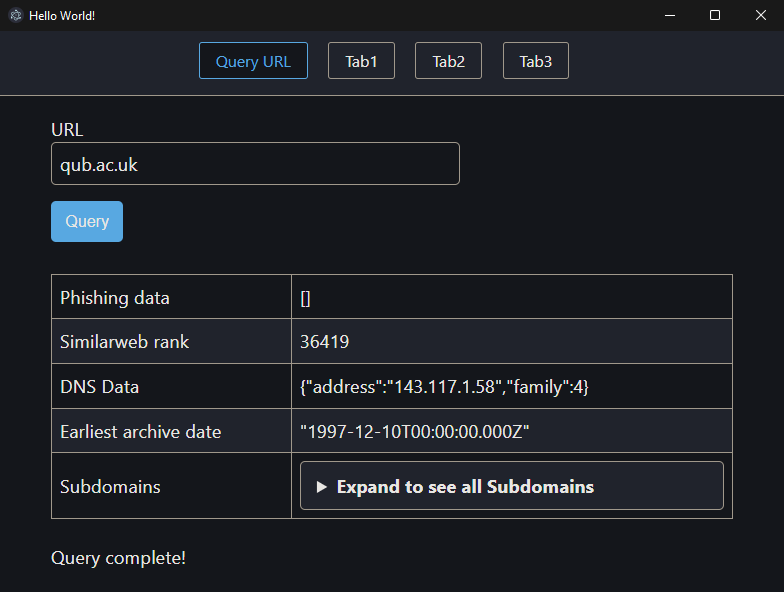
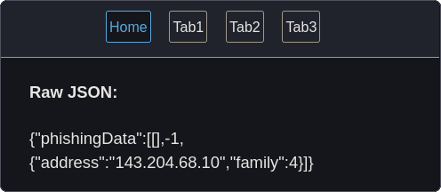
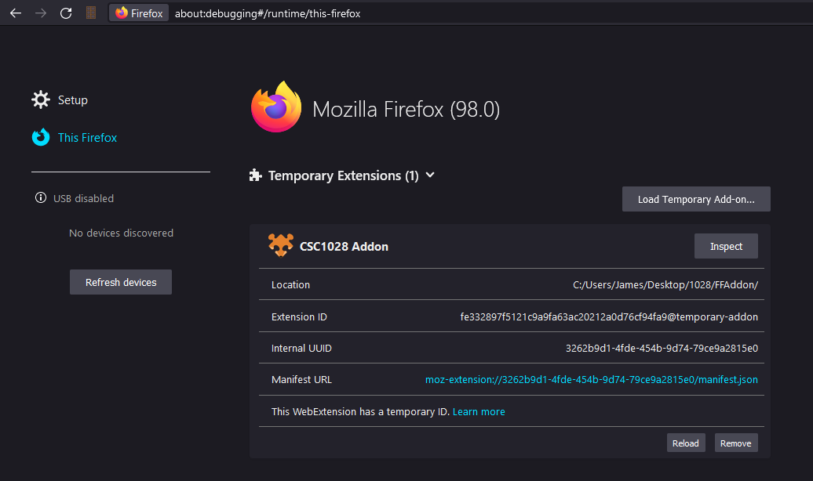

Blog post for CSC1028
A summary of the project
04/03/2022
nodejs, project sonar, programming
-----
THIS POST IS STILL WIP! INITIAL TEST
# URL Understanding Tool
This project was created over the course of 7 weeks for my CSC1028 module, and although it is not a fully complete project, it provides a great framework for future work.

The project has 3 main parts:

## HTTP APIs
[GitHub](https://github.com/James-McK/CSC1028APIs)  
The main component of this project is a set of HTTP APIs that can be queried for information on a URL/IP address to provide information from various sources, from local databases to external APIs.
The current data sources are:  
 - A local MongoDB database containing data from Project Sonar
 - A local MongoDB database containing data on phishing/malware URLs from [Phishtank](https://phishtank.org/), [OpenPhish](https://openphish.com/), [URLHaus](https://urlhaus.abuse.ch/) and [MalwareDiscoverer](https://malwarediscoverer.com/).
 - Earliest page/hostname archive date, from <https://archive.org>.
 - [Similarweb](https://www.similarweb.com/) global website rank
 - IP Geolocation data (Currently from <https://ip-api.com/>, could probably be improved - this section did not have much thought put into it, and was mostly done as a proof of concept)

For more information on dealing with Project Sonar's data, see [my how-to guide](https://mck.is/project-sonar/), but in summary, the data is stored in a local MongoDB database which, when full, can fill up to 60gb. We then use [text indexes](https://docs.mongodb.com/manual/core/index-text/) to allow *extremely* performant queries to be made.

Note on Project Sonar's data:
6 days after I wrote my how-to guide, [Rapid7 switched to requiring you to apply](https://www.rapid7.com/blog/post/2022/02/10/evolving-how-we-share-rapid7-research-data-2/) to access Project Sonar's data. Except now, a few weeks later, it no longer requires an account again, and this time I cannot find any blog post etc. mentioning this change back, so I do not know if this is a permanent or temporary change.

Several of these can also be queried via the command line, i.e. `node queryArchiveDate.js example.com`

### Retrieving data
To retrieve the data used for the above HTTP APIs, some of the modules send a request to an external API, while some query a local MongoDB database. To fetch the data used to fill up the MongoDB database, there exists two programs: One for parsing and inserting Project Sonar's data, and one for fetching, parsing and inserting malware/phishing data.

### Creating the HTTP APIs
To create and manage the HTTP APIs, there is a single program (`createAllAPI.js`) that opens up all the APIs when run. This program does almost nothing itself, and imports functionality from other modules to create the APIs (Notably `createHTTPServer.js`, which will take any function and open up an API for it on the given port.). This approach allows new APIs to be added with ease, and allows you to manage which modules are started.

### Running/developing the application
For developing any of this project, you'll need a few things set up and installed. I'd recommend following the setup process I used in [my how-to guide](https://mck.is/project-sonar/#setup). You'll also want to install the dependancies listed in `package.json` with `npm install <package_name>`.
To actually get the data, you'll first want to run `./fetch/fetchMalwarePhishingData.js` and `./fetch/fetchMalwarePhishingData.js` (Assuming you've downloaded Project Sonar's data in a similar way as I did in my [how-to guide](https://mck.is/project-sonar/#parsing-a-local-copy-of-project-sonar)).  
You can then run `node ./create/createAllAPI.js` to start the APIs.

## Electron App

[GitHub](https://github.com/James-McK/CSC1028ElectronApp)

The electron app provides a user-friendly interface allowing the user to make queries regarding any URL, and displays the data to the user in a better format than the entirely raw JSON, however further steps should be taken as the current presentation is still not easily readable.

Since it is built with electron, the page is little more than a HTML page with some javascript behind it! As a result, all this app has to do is query the back-end HTTP APIs and display the result to the user!

### Running the application
Assuming you've followed the steps above for running/developing the central node.js app (Which you should have done, as this electron app isn't too useful without it), not much more is required to run the electron app. After opening the folder, you'll need to run `npm install --save-dev electron` to install everything required for electron. You can then run `npm start` to start the app.

## Browser Addon

[GitHub](https://github.com/James-McK/CSC1028FFAddon)

The browser addon is extremely similar to the electron app, providing a user-friendly front end to the data, built with HTML and javascript. As it is integrated into the browser, it can automatically fetch and cache data as the user navigates the web.  
Note: The addon currently only supports Firefox, however it could be ported to support Chromium-based browsers extremely easily, as both share an extremely similar base API, with only a few functions being located in different namespaces, but providing the same results. (See [Chrome incompatibilities](https://developer.mozilla.org/en-US/docs/Mozilla/Add-ons/WebExtensions/Chrome_incompatibilities) on MDN for details)

The addon's UI is also currently lacking as I chose to shift focus away from it, as I decided the Electron UI was more important initially. However, since both are based on HTML and javascript, and the Electron app was built upon the framework of the browser addon, the updates for the Electron app should be able to be ported without too much effort.

### Installing the addon
(Currently Firefox-only)  
Installing the addon is thankfully easy. Navigate to `about:debugging` and click on the "This Firefox" tab. Click on "Load Temporary Add-on..." and navigate to the folder containing the addon files. Click on any of the files (e.g. `manifest.json`) and load it. The addon is now loaded! Whenever you update your code and save it, you just need to click the "Reload" button that appears.

## Improvements and vision
The project in its current state is nowhere near complete, but serves as a foundation to build further upon.

There are many possible new data sources that could be integrated into the project, for example:
 - Crowdsourced datasets, eg Trustpilot and other user-driven sources of metadata
 - What tech stack companies are using, and alert the user to suspicious activity if a different result is actually found, using information from <https://stackshare.io>
 - Further integration with archives, e.g. thumbnails of pages from the [Wayback Machine](https://web.archive.org/) - If a webpage has only existed for a few days its chance of being malware or a phishing attack are higher
 - Data from [Common Crawl](https://commoncrawl.org/) to find sites that point to a given page (They were having [issues with 503 errors](https://groups.google.com/g/common-crawl/c/kEHzXZNu5To) when I last looked into integrating this, although it appears to have been fixed since.)
 And many other possible sources of interesting metadata!
