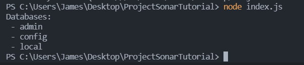

How to deal with Project Sonar's data
From the beginning
30/01/2022
-----
## Setup
To start, you're going to want to be using an IDE - I'd reccommend [Visual Studio Code](https://code.visualstudio.com/). This guide is written assuming you're using VS Code, but everything will still work if you choose a different IDE.

Start by making a new folder to hold your project - I called mine ProjectSonarTutorial - and open it in VS Code. We're going to need to install Node.js too - a convenient way to do so is using a version manager like [nvm](https://github.com/nvm-sh/nvm) for Linux and MacOS, or [nvm-windows](https://github.com/coreybutler/nvm-windows) for Windows.

Once you have one of these installed (Note: On windows, you may have to restart to use nvm), we can install install Node.js. Open up a terminal as administrator (Or run the seccond command with `sudo` on linux/mac) and run `nvm install 16`. This will install the latest version of Node 16, currently 16.13.2 (We have to use Node 16 instead of the newer 17 as not all packages are currently compatible with it), then run `nvm use 16.13.2`. Now we have node.js installed and set up!

We're also going to be using MongoDB - I used a local installation for this tutorial. To install it, follow the instructions over at <https://docs.mongodb.com/manual/installation/> MongoDB compass might be installed along side it, but if not, I'd reccommend installing it too.

Returning to VS Code, we can open up its built in terminal with `ctrl + '`. We're going to need a few external packages later, so we might as well install them now. First up, we'll generate the package.json file (Where information like what packages your program depends on) is stored, by running `npm init`. `npm` stands for Node Package Manager, and is how you can install external packages (Like the MongoDB Node.js Driver) to use in your program. `npm init`'s defaults are good enough, however you can change them if you wish. Next up, open the `package.json` file that was created, and add the line `"type": "module",` below the description line - This marks our program as using the newer `import` syntax instead of the older `require` syntax. Be aware that some tutorials still make use of the old syntax, however. Finally, run `npm install mongodb` and `npm install tldts-experimental` to install the packages that we need.  (Explain generated package.json etc?)

## Start programming

Now we can begin to get to the interesting stuff: create a file called `index.js`. At the top of it, we can add
```
import { MongoClient } from "mongodb";
import { parse as tldParse } from "tldts-experimental";
import zlib from "zlib";
import fs from "fs";
import { get as getHttps } from "https";
import readline from "readline";
```
This imports what we need from the two packages we just installed, along with what we'll need from node's core modules.

We'll then add our main function:
```
/**
 * Main function
 */
async function main() {
	// Content of main function goes here
}


// Run the main function
main().catch(console.error);
```

To make sure everything is up and running, add the typical "Hello World" to the main function with `console.log("Hello World!");`. To run the program, go to the terminal and run `node index.js` - Hopefully you should be greeted with "Hello World!" being logged.

Next up we'll connect to MongoDB. Since we're using a local database, the connection URI should be as simple as `"mongodb://localhost:27017"`. Then we can create a new MongoClient, and pass our connection string to its constructor. Then we can open the connection with `await client.connect();` To make sure everything is working, we can print a list of all databases. Let's make a function for it!

```
async function listDatabases(client) {
    let dbList = await client.db().admin().listDatabases();
 
    console.log("Databases:");
    dbList.databases.forEach(db => console.log(` - ${db.name}`));
};
```

Call the new listDatabases function from within our main function, and pass it the MongoClient we created, after opening its collection. Running our code so far (with `node index.js`) we should get something like this:


Your code so far should be similar to
```
import { MongoClient } from "mongodb";
import { parse as tldParse } from "tldts-experimental";
import zlib from "zlib";
import fs from "fs";
import { get as getHttps } from "https";
import readline from "readline";

/**
 * Main function
 */
async function main() {
	// Database is currently hosted on same machine
	const uri = "mongodb://localhost:27017";
	const client = new MongoClient(uri);

	try {
		// Connect to MongoDB
		await client.connect();
		
		// List databases
		await listDatabases(client);
	} catch (e) {
		console.error(e);
	}
}

async function listDatabases(client) {
	let dbList = await client.db().admin().listDatabases();

	console.log("Databases:");
	dbList.databases.forEach((db) => console.log(` - ${db.name}`));
}

// Run the main function
main().catch(console.error);
```

You'll probably have noticed that the program still appears to be running, and you can no longer type in the terminal. You can press Ctrl + c when focused on the terminal to stop the currently running program at any time.

2 Options:

## Fetching a local copy of Project Sonar
Project Sonar's data can be found at <https://opendata.rapid7.com/sonar.fdns_v2/>. I'll be using the DNS 'A' records for this guide, but I'll be talking more about what the other items are later. Since we're using the A records, we need the file ending in `-fdns_a.json.gz`. Do note that the file is large (17gb) and be careful not to unzip it - uncompressed, it is over 200gb!

Let's add a new function, `readFromFile`.

```
async function readFromFile() {
 const sonarDataLocation = "fdns_a.json.gz";
 return fs.createReadStream(sonarDataLocation);
}
```

`sonarDataLocation` should be wherever you saved the data to - either a relative path, in the current case, or an absolute path, like `C:\\Users\\James\\Downloads\\fdns_a.json.gz`. This function returns a read stream - not the actual data itself - that we can later read through and parse.

`fs` is Node.js's filesystem module, allowing us to interact with local files.

Alternatively:

## Fetching an online version of Project Sonar
This method is a bit more complicated, but means that we do not have to keep a copy saved on our machine, taking up space. It will require you to have a reliable internet connection, however.

Let's add a new function, `readFromWeb`.
```
async function readFromWeb(url) {
	getHttps(url, function (res) {
		// Code here
	}).on("error", function (e) {
		console.error(e);
	});
}
```
This function calls the get method from node's https package that we imported earlier as `getHttps`. It gets the result of this call as `res`, currently does northing with it, and will log any errors. So what do we do with this result? First of all, we need to deal with redirects. <https://opendata.rapid7.com/sonar.fdns_v2/2021-12-31-1640909088-fdns_a.json.gz>, The link on Project Sonar's site, actually redirects to backblaze, where the data is actually hosted, before allowing you to download it.

Fortunately, we can check if we need to redirect based on the result's [HTTP status code](https://httpstatuses.com/). If the status is 200, we're in the right place, and can return the result to be used elsewhere. If the status is 301 or 303, we should follow the redirect by calling the readFromWeb method again, with the new URL being passed in as an argument. I've added the following code inside the above `getHttps` call:
```
if (res.statusCode === 200) {
	return res;
} else if (res.statusCode === 301 || res.statusCode === 302) {
	// Recursively follow redirects, only a 200 will resolve.
	console.log(`Redirecting to: ${res.headers.location}`);
	readFromWeb(res.headers.location);
} else {
	console.log(`Download request failed, response status: ${res.statusCode} ${res.statusMessage}`);
}
```
This function returns a read stream - not the actual data itself - that we can later read through and parse.